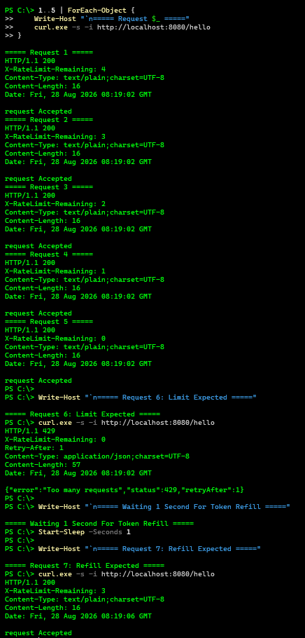
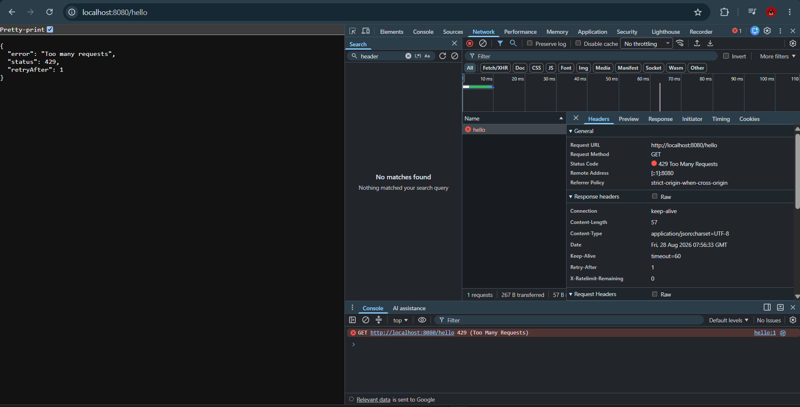
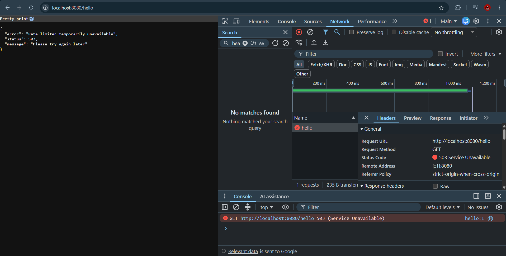
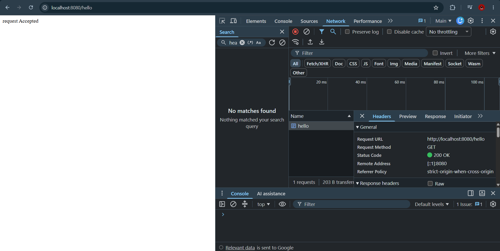
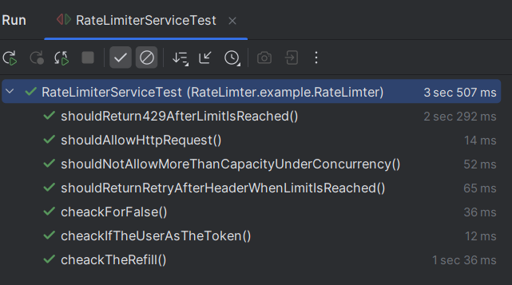
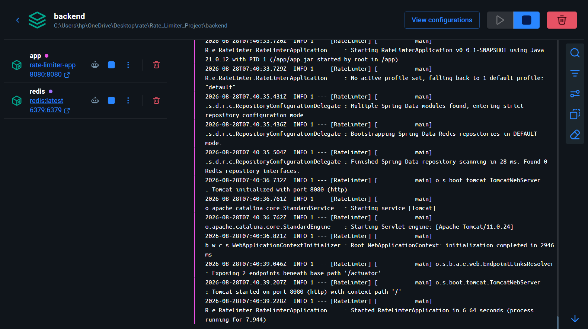

---

# 🚦 Distributed Rate Limiter

> A distributed rate limiter built with Spring Boot 4, Redis, and Lua scripting.
> Implements the **Token Bucket Algorithm** with atomic distributed state management, HTTP-level rate limiting, atomic rate-limit enforcement and concurrency testing, Docker deployment, and graceful Redis failure handling.

## 📌 Overview

Rate limiting protects backend services from abuse and overload.

A simple in-memory rate limiter works for a single application instance, but breaks when the application runs across multiple servers because each server maintains its own request state.

This project solves that problem by storing rate-limit state in **Redis** and executing the Token Bucket algorithm atomically using a **Lua script**.

### Key idea

```text
Without Redis

Client
   │
   ▼
App Instance 1 → 5 requests allowed
App Instance 2 → 5 requests allowed

Problem: Same client can bypass the global limit.
```

```text
With Redis

                 ┌──────────────┐
                 │    Client    │
                 └──────┬───────┘
                        │
          ┌─────────────▼─────────────┐
          │   Spring Boot Instances   │
          └─────────────┬─────────────┘
                        │
                        ▼
              ┌─────────────────┐
              │      Redis      │
              │ Shared State +  │
              │ Atomic Lua Logic│
              └─────────────────┘
```

Redis becomes the shared source of truth for available tokens.

---

# 🏗️ Architecture

```text
                       ┌─────────────────┐
                       │   HTTP Client   │
                       └────────┬────────┘
                                │
                                ▼
                    ┌───────────────────────┐
                    │  RateLimiterFilter    │
                    │                       │
                    │ Extract Client IP     │
                    └───────────┬───────────┘
                                │
                                ▼
                    ┌───────────────────────┐
                    │  RateLimiterService   │
                    └───────────┬───────────┘
                                │
                                ▼
                    ┌───────────────────────┐
                    │     Redis + Lua       │
                    │                       │
                    │ Atomic Token Bucket   │
                    └───────────┬───────────┘
                                │
                  ┌─────────────┴─────────────┐
                  │                           │
                  ▼                           ▼
          ┌───────────────┐           ┌───────────────┐
          │ Token Exists  │           │ Bucket Empty  │
          │               │           │               │
          │ Continue to   │           │ Return 429    │
          │ Controller    │           │ immediately   │
          └───────┬───────┘           └───────────────┘
                  │
                  ▼
             HTTP 200 OK
```

---

# ⚙️ How the Token Bucket Works

The limiter is configured with:

```properties
rate.limiter.capacity=5
rate.limiter.refill-rate=1
rate.limiter.ttl=60
```

This means:

- Maximum bucket capacity: **5 tokens**
- Refill rate: **1 token per second**
- Redis state TTL: **60 seconds**

### Example

```text
Initial Bucket

[ ● ● ● ● ● ]  = 5 tokens

Request 1 → 200 → 4 tokens
Request 2 → 200 → 3 tokens
Request 3 → 200 → 2 tokens
Request 4 → 200 → 1 token
Request 5 → 200 → 0 tokens

Request 6 → 429 Too Many Requests

Wait 1 second

[ ● ○ ○ ○ ○ ]  = 1 token restored

Request 7 → 200
```

---

# 🧪 Live Token Bucket Demonstration

The following test was performed against the running application.

### Requests 1–5

All five requests are accepted.

```text
Request 1 → 200 → Remaining: 4
Request 2 → 200 → Remaining: 3
Request 3 → 200 → Remaining: 2
Request 4 → 200 → Remaining: 1
Request 5 → 200 → Remaining: 0
```

### Request 6

The bucket is empty.

```text
HTTP/1.1 429
X-RateLimit-Remaining: 0
Retry-After: 1

{
  "error": "Too many requests",
  "status": 429,
  "retryAfter": 1
}
```

### After waiting one second

A token is refilled and another request is allowed.

```text
Request 7 → HTTP 200
```

---

# 📸 Proof of Execution

## Token Bucket Behaviour



The terminal demonstrates the complete flow:

1. Five requests are accepted.
2. The sixth request receives HTTP `429`.
3. The server returns `Retry-After: 1`.
4. After one second, a token is refilled.
5. The next request succeeds.

---

## HTTP 429 Too Many Requests



The browser network inspector confirms:

```text
Status Code: 429 Too Many Requests
Retry-After: 1
X-RateLimit-Remaining: 0
```

The response body is:

```json
{
  "error": "Too many requests",
  "status": 429,
  "retryAfter": 1
}
```

---

## Redis Failure Handling

If Redis becomes unavailable, the application does not expose an internal `500` error.

Instead, the rate limiter fails gracefully:

```text
HTTP/1.1 503 Service Unavailable
```



Response:

```json
{
  "error": "Rate limiter temporarily unavailable",
  "status": 503,
  "message": "Please try again later"
}
```

This behaviour is important because the rate limiter itself should not cause uncontrolled application failures.

---

## Successful Request



Successful requests return:

```text
HTTP 200 OK
```

With the remaining token count exposed through:

```text
X-RateLimit-Remaining
```

---

## Automated Tests



The project includes unit, integration, and concurrency testing.

Current verified scenarios include:

- HTTP request allowed successfully
- Initial token availability
- Request rejected when bucket is empty
- Token refilled after elapsed time
- HTTP `429` response verification
- `Retry-After` header verification
- Concurrent request protection

### Concurrency Test

The application simulates **20 concurrent threads** attempting to access the limiter.

```text
20 Concurrent Requests
        │
        ▼
  Rate Limiter
        │
        ▼
Maximum 5 Requests Allowed
```

The test verifies that no more requests than the configured bucket capacity are permitted.

---

## Docker Deployment



The application runs as two containers:

```text
┌─────────────────────────────┐
│ Spring Boot Application     │
│ Port: 8080                  │
└──────────────┬──────────────┘
               │
               ▼
┌─────────────────────────────┐
│ Redis                       │
│ Port: 6379                  │
└─────────────────────────────┘
```

---

# 🔄 Request Flow

### 1. Request enters the application

```text
GET /hello
```

### 2. `RateLimiterFilter` intercepts the request

The request is intercepted before reaching the controller.

### 3. Client is identified

Currently using:

```java
request.getRemoteAddr()
```

The client identifier is used to generate a Redis key.

```text
rate-limiter:<client-ip>
```

### 4. Lua script executes inside Redis

The script:

- Reads current tokens
- Calculates elapsed time
- Refills tokens
- Checks token availability
- Consumes a token if allowed
- Stores the updated state

All of this happens atomically.

### 5. Request is either allowed or rejected

```text
Token Available?
       │
   ┌───┴────┐
   │        │
  YES       NO
   │        │
   ▼        ▼
200 OK    429
```

---

# 🧠 Why Lua Scripting?

A normal rate limiter may require multiple Redis operations:

```text
GET tokens
GET last refill
Calculate tokens
Update tokens
Update refill time
```

Under concurrent requests, separate operations can create race conditions.

Instead:

```text
Spring Boot
     │
     ▼
Execute Lua Script
     │
     ▼
Redis executes the entire
Token Bucket operation atomically
```

This prevents multiple requests from simultaneously reading and consuming the same token.

---

# 📁 Project Structure

```text
Rate_Limiter/
│
├── README.md
│
├── docs/
│   └── images/
│
└── backend/
    ├── Dockerfile
    ├── docker-compose.yml
    ├── pom.xml
    │
    └── src/
        ├── main/
        │   ├── java/
        │   │   └── RateLimter/example/RateLimter/
        │   │       ├── RateLimterApplication.java
        │   │       │
        │   │       ├── config/
        │   │       │   ├── RateLimiterProperties.java
        │   │       │   └── RedisConfig.java
        │   │       │
        │   │       ├── controllers/
        │   │       │   └── Controllers.java
        │   │       │
        │   │       ├── filters/
        │   │       │   └── RateLimiterFilter.java
        │   │       │
        │   │       └── services/
        │   │           ├── RateLimitResult.java
        │   │           └── RateLimiterService.java
        │   │
        │   └── resources/
        │       ├── application.properties
        │       └── rate-limiter.lua
        │
        └── test/
            └── RateLimiterServiceTest.java
```

---

# ✨ Features

- 🚦 Token Bucket rate limiting
- 🌐 Distributed state management using Redis
- 🔒 Atomic rate-limit calculations using Lua
- 🧵 Concurrency testing
- 🚫 HTTP `429 Too Many Requests`
- ⏱️ `Retry-After` response header
- 📊 `X-RateLimit-Remaining` response header
- ❌ Structured JSON error responses
- 🛡️ Graceful Redis failure handling with HTTP `503`
- ⚙️ Configurable rate-limit parameters
- 🔍 SLF4J logging
- ❤️ Spring Boot Actuator health checks
- 🐳 Dockerized Spring Boot application
- 🟥 Dockerized Redis
- 🔗 Docker Compose orchestration

---

# ⚙️ Configuration

```properties
spring.application.name=RateLimter

# Rate Limiter
rate.limiter.capacity=5
rate.limiter.refill-rate=1
rate.limiter.ttl=60

# Redis
spring.data.redis.host=localhost
spring.data.redis.port=6379
spring.data.redis.timeout=1s
spring.data.redis.connect-timeout=1s

# Actuator
management.endpoints.web.exposure.include=health,info
```

---

# 🚀 Running Locally

## Prerequisites

- Java 21
- Maven 3.8+
- Redis
- Docker

### Start Redis

```bash
redis-server
```

### Build the application

```bash
cd backend
mvn clean package -DskipTests
```

### Run

```bash
mvn spring-boot:run
```

Application:

```text
http://localhost:8080
```

---

# 🐳 Running with Docker

```bash
cd backend
mvn clean package -DskipTests
docker compose up --build
```

Stop containers:

```bash
docker compose down
```

---

# 📡 API Behaviour

## Allowed Request

```bash
curl -i http://localhost:8080/hello
```

Example:

```text
HTTP/1.1 200 OK
X-RateLimit-Remaining: 4

request Accepted
```

---

## Rate Limit Exceeded

```text
HTTP/1.1 429 Too Many Requests
Retry-After: 1
X-RateLimit-Remaining: 0
```

```json
{
  "error": "Too many requests",
  "status": 429,
  "retryAfter": 1
}
```

---

## Redis Unavailable

```text
HTTP/1.1 503 Service Unavailable
```

```json
{
  "error": "Rate limiter temporarily unavailable",
  "status": 503,
  "message": "Please try again later"
}
```

---

# 🧪 Running Tests

```bash
cd backend
mvn test
```

The test suite includes:

- Unit tests
- HTTP integration tests
- Header verification
- Token refill verification
- Concurrency testing

---

# 🔮 Future Improvements

- API-key-based client identification
- JWT-based rate limiting
- Per-user rate limits
- Per-route configuration
- Different limits for authenticated users
- Fail-open and fail-closed strategies
- Redis Cluster support
- Metrics with Prometheus
- Monitoring dashboards
- Multiple rate-limiting strategies

---

# 🎯 What This Project Demonstrates

This project demonstrates practical backend engineering concepts beyond basic CRUD development:

```text
Spring Boot
    +
Redis
    +
Distributed Systems
    +
Concurrency
    +
Lua Scripting
    +
HTTP Filters
    +
Docker
    +
Failure Handling
    +
Testing
```

---


